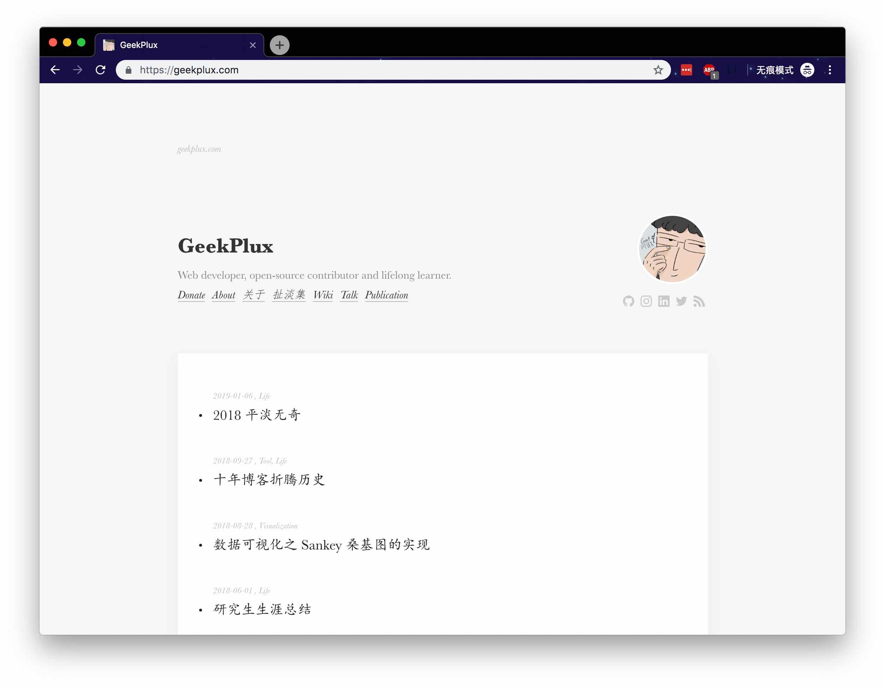
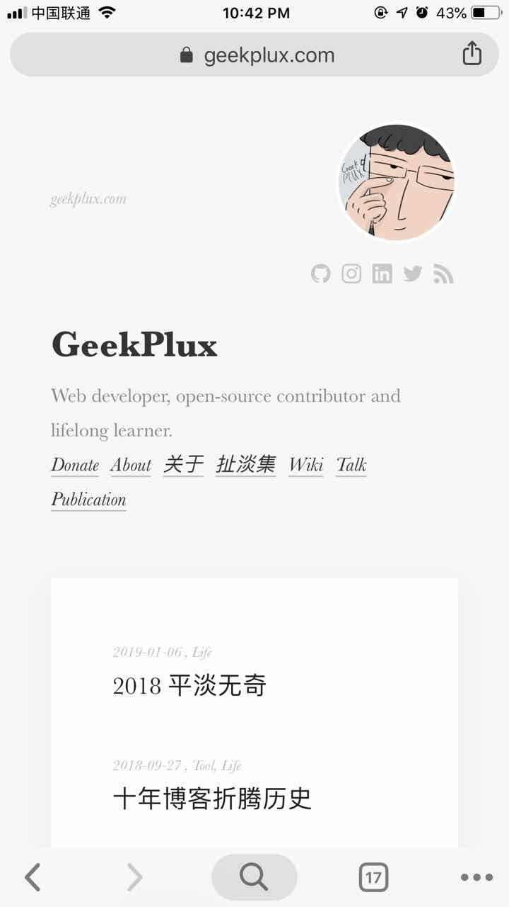

# saber-theme-paper

[](https://npm.im/saber-theme-paper)

> A simple theme like read on a paper.

## Demo

- [Demo site](https://geekplux.com)


## Preview


<!--  -->

## Install

```bash
yarn add saber-theme-paper
```

In your `saber-config.yml`:

```yml
theme: paper
```

This theme is better working with following plugins:

- `saber-plugin-query-posts`: Inject `posts` to homepage's `page` prop, generate tag pages
- `saber-plugin-generate-feed`: Generate JSON feed at `/feed.json`.

```bash
yarn add saber-plugin-query-posts saber-plugin-generate-feed
```

```yml
plugins:
  - resolve: saber-plugin-query-posts
  - resolve: saber-plugin-generate-feed
    options:
      atomFeed: true
```

## Layouts

- `post`: For blog post pages.
- `page`: For normal pages.
- `default`: For any other pages like homepage and tag pages.

## Site Config

Configure site title, description etc in your `saber-config.yml`:

```yml
siteConfig:
  domain: yourdomain.com
  title: yourWebsiteTitle
  description: anything you want to put
  avatar: /youravatar.jpg
  url: https://yourdomain.com
  license:
    text: CC BY-NC-ND 4.0
    link: https://creativecommons.org/licenses/by-nc-nd/4.0/
  pagination:
    prevPage: back
    nextPage: more articles
    prevPost: prev post
    nextPost: next post
```

## Theme Config

### Navbar

Configure `nav` to show a set of links in header:

```yml
themeConfig:
  nav:
    - text: Home
      link: /
    - text: About
      link: /about.html
```

### Social

Configure the accounts of your social network to show at the bottom of homepage:

```yml
themeConfig:
  social:
    dribbble: username
    facebook: username
    flickr: username
    github: username
    instagram: username
    linkedin: username
    pinterest: username
    twitter: username
    youtube: username
    telegram: username
    microdotblog: username
    googleplus: username
    rss: true
```

### Comments

You can use Disqus:

```yml
themeConfig:
  disqus: disqus-short-name
# Note that `siteConfig.url` is required for Disqus
siteConfig:
  url: https://example.com
```

Comments are only enabled for `post` layout, to disable comments in specific page, you can use the page attribute `comments`:

```markdown
---
title: Hello
layout: post
date: 2018-08-12
comments: false
---

Hello World!
```

## License

MIT © [GeekPlux](https://github.com/geekplux)

> [Website](https://geekplux.com) · GitHub [@geekplux](https://github.com/geekplux) · Twitter [@geekplux](https://twitter.com/geekplux)
